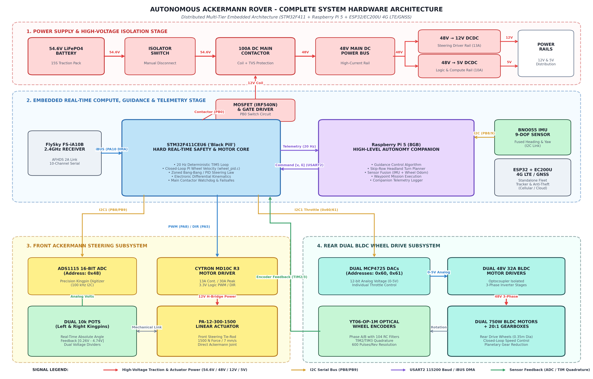
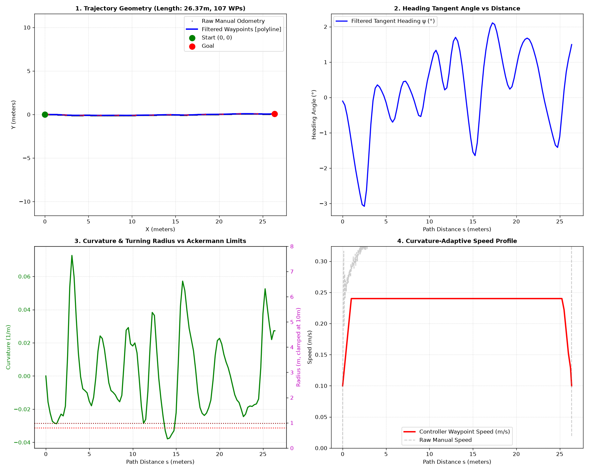
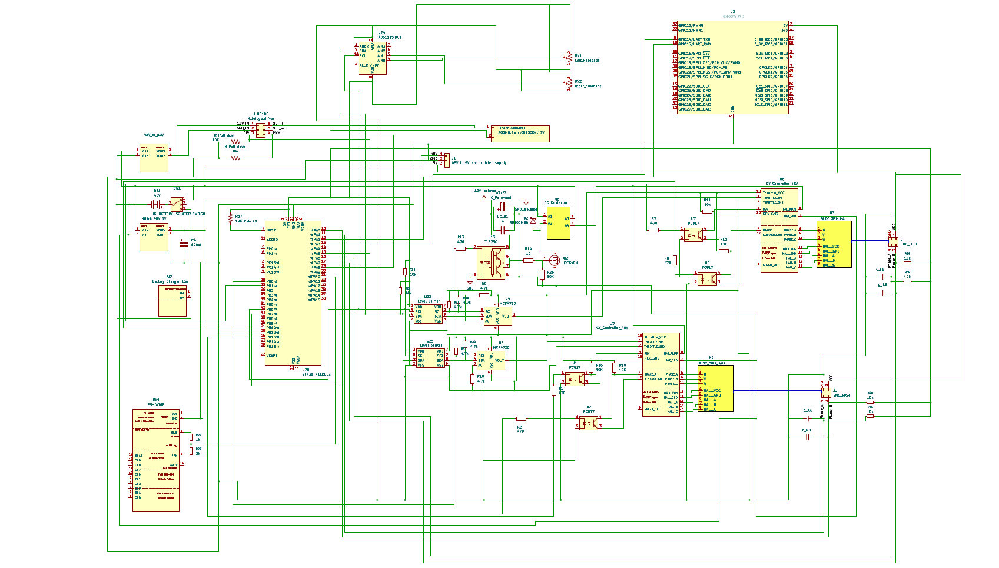

# Design, Real-Time Embedded Control & Autonomous Navigation for an Agricultural Ackermann Rover

[](https://iitpkd.ac.in)
[](https://ee.iitpkd.ac.in)
[](https://www.st.com/en/microcontrollers-microprocessors/stm32f411ce.html)
[](https://www.raspberrypi.com/products/raspberry-pi-5/)
[]()

> **Internship Project Report & Engineering Handover**  
> **Author:** Jagan J S (*Embedded Engineering Intern, Department of Electrical Engineering, IIT Palakkad*)  
> **Project:** *Aerial Dexterous Manipulators, Grasping and Transportation / Autonomous Agricultural Robotics*  
> **Documentation:** 📄 [Internship Report (PDF)](docs/Internship_Report.pdf) | 📘 [Handover Document (PDF)](docs/Handover_Document.pdf) | 📋 [Technical Handover Guide (MD)](docs/SUCCESSOR_HANDOVER_GUIDE.md)

---

## 📌 Executive Summary

Modern precision agriculture relies on autonomous unmanned ground vehicles (UGVs) to execute labour-intensive field tasks such as row monitoring, precision spraying, and selective weeding. 

This repository houses the complete electrical architecture, bare-metal C firmware, PCB design files, and Python autonomy stack developed to transform a legacy, open-loop BeagleBone Black differential-drive rover into a distributed, closed-loop **STM32F411 + Raspberry Pi 5 Ackermann-steering autonomous agricultural rover**.



---

## 🏗️ System Architecture

The vehicle is structured across a decoupled, multi-tiered hierarchy:

```
+-----------------------------------------------------------------------------+
|                             POWER SYSTEM (54.6V)                            |
|        54.6V LiFePO4 --> Isolator --> 100A DC Contactor --> 48V DC Bus      |
|                                         |                                   |
|                      +------------------+-------------------+               |
|                      |                                      |               |
|              48V -> 12V Buck                        48V -> 5V Buck          |
|              (Actuator & Driver)                    (Logic & RPi 5)         |
+-----------------------------------------------------------------------------+
                                       │
                                       ▼
+-----------------------------------------------------------------------------+
|                        HIGH-LEVEL COMPUTE & AUTONOMY                        |
|                                                                             |
|   +-----------------------+                    +------------------------+   |
|   |   Raspberry Pi 5      |<─── I2C1 (400k) ───| BNO055 9-DOF IMU       |   |
|   |   Autonomy Engine     |                    +------------------------+   |
|   |   • Stanley / Pure    |                                                 |
|   |     Pursuit Followers |                    +------------------------+   |
|   |   • Skip-Row Planner  |                    | 4G UGV Tracker (ESP32) |   |
|   |   • Odom / IMU Fusion |                    | • Quectel EC200U LTE   |   |
|   +-----------------------+                    | • Standalone Telemetry |   |
|               │                                +------------------------+   |
|               │ UART 115200 (USART2 Binary Protocol + DMA)                  |
|               ▼                                                             |
+-----------------------------------------------------------------------------+
                                       │
                                       ▼
+-----------------------------------------------------------------------------+
|                       REAL-TIME EMBEDDED CONTROL CORE                       |
|                                                                             |
|   +---------------------------------------------------------------------+   |
|   |                    STM32F411CEU6 ("Black Pill")                     |   |
|   |   • 20 Hz Deterministic Loop (TIM5 Hardware Timer)                  |   |
|   |   • Discrete PI Wheel Velocity Control (wheel_pid.c)                |   |
|   |   • Dual-Zone Linear Actuator Steering Control (actuator.c)         |   |
|   |   • Electronic Differential Geometry Computation                    |   |
|   |   • Contactor MOSFET Switch & 400ms Hard RF Failsafe Ladder         |   |
|   +---------------------------------------------------------------------+   |
|          │             │                 │                   │              |
+----------│-------------│-----------------│-------------------│--------------+
           │             │                 │                   │
  PWM/DIR (PA8/5)   I2C1 (0x48)      I2C1 (0x60/61)      TIM2/3 Quadrature
           │             │                 │                   │
           ▼             ▼                 ▼                   ▼
    +-------------+ +----------+    +---------------+   +------------------+
    | Cytron MD10C| | ADS1115  |    | Dual MCP4725  |   | YT06-OP-1M Optic |
    | Motor Driver| | 16-b ADC |    | 12-bit DACs   |   | Wheel Encoders   |
    +-------------+ +----------+    +---------------+   +------------------+
           │             ▲                 │                     ▲
           ▼             │                 ▼                     │
    +-------------+ +----------+    +---------------+            │
    | PA-12 Linear| | Dual 10k |    | Dual BLDC     |────────────┘
    | Actuator    | | Kingpin  |    | Motor Drivers |
    | (Steering)  | | Pots     |    | (48V 32A)     |
    +-------------+ +----------+    +---------------+
                                           │
                                           ▼
                                    +---------------+
                                    | Dual 750W BLDC|
                                    | 20:1 Gearbox  |
                                    +---------------+
```

---

## ⚙️ Mechanical & Kinematic Specifications

| Parameter | Symbol | Engineering Value | Firmware Reference |
| :--- | :---: | :--- | :--- |
| **Wheelbase** | $L$ | $0.850\text{ m}$ ($850\text{ mm}$) | `ROVER_WHEELBASE_M` |
| **Track Width** | $W$ | $0.800\text{ m}$ ($800\text{ mm}$) | `ROVER_TRACK_WIDTH_M` |
| **Wheel Radius** | $r$ | $0.175\text{ m}$ ($175\text{ mm}$) | `ROVER_WHEEL_RADIUS_M` |
| **Gearbox Reduction** | $G$ | $20:1$ Planetary Reduction | Motor-to-Axle Ratio |
| **Max Linear Velocity** | $v_{\text{max}}$ | $0.458\text{ m/s}$ ($1.65\text{ km/h}$) | `MAX_LINEAR_VELOCITY` |
| **Nominal Cruise Speed** | $v_{\text{cruise}}$ | $0.240\text{ m/s}$ ($0.86\text{ km/h}$) | Path tracking default |
| **Max Steering Angle** | $\delta_{\text{max}}$ | $\pm 45.0^\circ$ | `STEER_MAX_DEG` |
| **Minimum Turning Radius**| $R_{\text{min}}$ | $\approx 2.50\text{ m}$ | Non-holonomic steering limit |

---

## 🧩 Key Subsystems & Features

### 1. STM32 Bare-Metal Firmware (`Rover_closed_loop/`)
- **Deterministic 20 Hz Execution:** Managed via hardware timer `TIM5` interrupt for jitter-free control.
- **Dual-Zone Steering Control:** Combines full-speed slewing in large error zones with fine-grained PID in small error deadbands to eliminate linear actuator overshoot.
- **Electronic Differential:** Dynamically calculates individual wheel speeds during turns:
  $$v_L = v \left(1 - \frac{W}{2L} \tan\delta\right), \quad v_R = v \left(1 + \frac{W}{2L} \tan\delta\right)$$
- **Hardware Failsafe Ladder:** 400 ms timeout on iBUS/serial input; immediately drops throttle and disengages contactor if signal loss occurs.

### 2. Raspberry Pi 5 Autonomy Engine (`RPi_companion/`)
- **Stanley & Pure Pursuit Controllers:** Robust cross-track and heading error compensation for path tracking.
- **Agricultural Skip-Row Headland Planning:** Solves turning infeasibilities where crop row spacing ($1.4\text{ m}$) is narrower than the vehicle's minimum turning radius ($2.5\text{ m}$).



### 3. Electrical & PCB Layout (`Hardware_KiCad/`)
- Custom schematic and 2-layer PCB layout incorporating optocouplers, RC snubber circuits, TVS diodes, and high-current copper pours.



---

## 📁 Repository Structure

```
Autonomous_Ackermann/
├── docs/
│   ├── figures/                       ← Architectural & field benchmark figures
│   ├── Internship_Report.pdf          ← Full academic internship report (IIT Palakkad)
│   ├── Handover_Document.pdf          ← Comprehensive technical handover manual
│   └── SUCCESSOR_HANDOVER_GUIDE.md    ← Markdown successor engineering guide
│
├── Rover_closed_loop/                 ← Production STM32 Bare-Metal Firmware
│   ├── Core/
│   │   ├── Inc/                       ← Header files (wheel_pid.h, main.h, etc.)
│   │   └── Src/                       ← Source files (main.c, wheel_pid.c, actuator.c)
│   ├── Drivers/                       ← STM32 HAL and CMSIS Drivers
│   └── Rover_closed_loop.ioc          ← STM32CubeMX Project Configuration
│
├── RPi_companion/                     ← Raspberry Pi 5 Python Autonomy Stack
│   ├── ackermann_controller.py        ← Stanley & Pure Pursuit path tracking
│   ├── rpi_stm32_bridge.py            ← Fast binary UART serial bridge
│   ├── make_lawnmower_path.py         ← Boustrophedon grid coverage generator
│   └── make_skip_row_path.py          ← Agricultural headland skip-row planner
│
├── Hardware_KiCad/                    ← Complete KiCad v6 Schematics & PCB Layout
│   ├── kicad_setup.kicad_pro          ← KiCad Project File
│   ├── kicad_setup.kicad_sch          ← Full System Schematic
│   └── kicad_setup.kicad_pcb          ← 2-Layer PCB Board Layout
│
├── ESP32_uart_sniffer/                ← Diagnostic UART sniffer firmware
└── Documentations/                    ← Detailed engineering logs and notes
```

---

## 🚀 Getting Started

### Building STM32 Firmware
1. Open [`Rover_closed_loop/`](file:///home/tuf/Documents/REPORT/Autonomous_Ackermann/Rover_closed_loop) in **STM32CubeIDE** or build using `make` / `arm-none-eabi-gcc`.
2. Flash via ST-Link V2 using STM32CubeProgrammer or OpenOCD:
   ```bash
   st-flash write build/Rover_closed_loop.bin 0x8000000
   ```

### Running Raspberry Pi 5 Autonomy
1. Connect Raspberry Pi 5 UART (`/dev/ttyAMA0`) to STM32 `USART2` (`PA2`/`PA3`).
2. Run the navigation controller:
   ```bash
   cd RPi_companion
   python3 ackermann_controller.py --controller stanley --path paths/lawnmower_pattern.csv
   ```

---

## 📜 Citation & Credits

* **Author:** Jagan J S
* **Affiliation:** Department of Electrical Engineering, Indian Institute of Technology Palakkad
* **Supervision:** *Aerial Dexterous Manipulators, Grasping and Transportation* Lab / OSDISG Research Group
